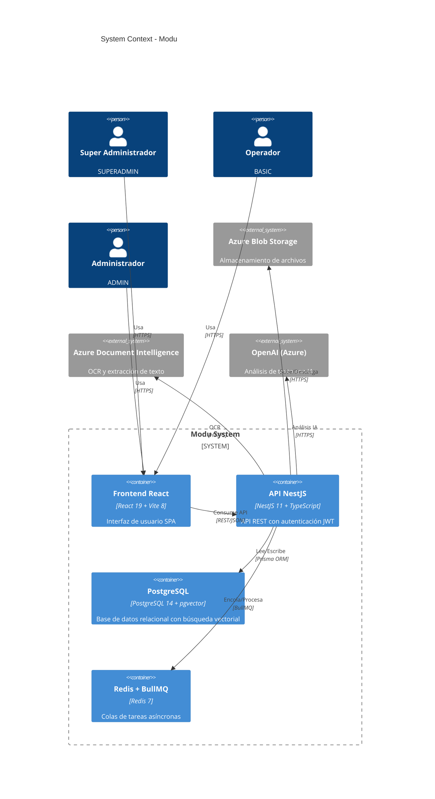
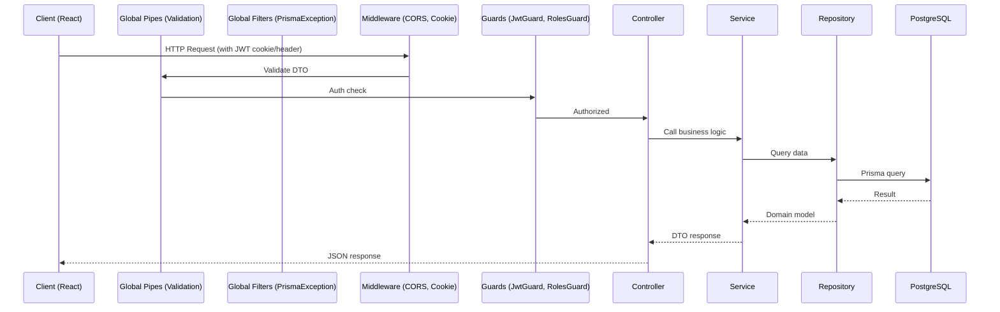

# Architecture — Modu

> **Propósito**: Describir la arquitectura general del sistema a nivel de contenedores, patrones y comunicación entre componentes.

---

## 1. Diagrama de Arquitectura (C4 — Nivel Contenedor)



## 2. Patrón Arquitectónico: Hexagonal (Puertos y Adaptadores)

```
┌─────────────────────────────────────────────────────────┐
│                      Controllers                         │
│              (routing, validación, decoradores)          │
└────────────────────────┬────────────────────────────────┘
                         │
┌────────────────────────▼────────────────────────────────┐
│                    Services (lógica negocio)              │
│              ┌─────────────────────────────┐             │
│              │  interfaces/ (PUERTOS)      │             │
│              │  default-*.ts (ADAPTADORES) │             │
│              └─────────────────────────────┘             │
└────────────────────────┬────────────────────────────────┘
                         │
┌────────────────────────▼────────────────────────────────┐
│                  Repositories (datos)                     │
│              ┌─────────────────────────────┐             │
│              │  interfaces/ (PUERTOS)      │             │
│              │  prisma-*.ts (ADAPTADORES)  │             │
│              └─────────────────────────────┘             │
└────────────────────────┬────────────────────────────────┘
                         │
┌────────────────────────▼────────────────────────────────┐
│                    Prisma → PostgreSQL                     │
│                    Azure Blob / DI / OpenAI              │
└─────────────────────────────────────────────────────────┘
```

### 2.1 Beneficio

El dominio (servicios + repositorios) no depende de infraestructura. Se puede reemplazar Prisma por otro ORM, Azure por AWS, o OpenAI por Anthropic cambiando solo el adaptador, sin tocar la lógica de negocio.

## 3. Flujo de Petición



## 4. Comunicación entre Componentes

| Origen | Destino | Protocolo | Formato |
|--------|---------|-----------|---------|
| Frontend | Backend | HTTP/HTTPS | JSON (REST) |
| Backend | PostgreSQL | TCP (Prisma) | SQL |
| Backend | Redis | TCP (BullMQ) | Serializado |
| Backend | Azure Blob | HTTPS | Binario |
| Backend | Azure DI | HTTPS | JSON/Binario |
| Backend | OpenAI | HTTPS | JSON |

## 5. Paquetes Compartidos

### @modu/shared

| Artefacto | Propósito |
|-----------|-----------|
| `PaginationQueryDto` | DTO base para paginación (page, pageSize) |
| `PagedResultDto<T>` | Interfaz genérica para resultados paginados |
| `PrismaExceptionFilter` | Filtro global de excepciones Prisma |
| `normalization.util` | Utilidades de normalización (strings, IDs) |

### @modu/database

| Artefacto | Propósito |
|-----------|-----------|
| `PrismaModule` | Módulo NestJS que provee PrismaService |
| `PrismaService` | Servicio singleton de Prisma Client |
| `PrismaTx` | Tipo para transacciones Prisma |
| `PrismaUnitOfWork` | Implementación de Unit of Work con Prisma transaccional |

### Unit of Work

```typescript
// Contract
interface UnitOfWork {
  executeTransaction<T>(callback: (tx: PrismaTx) => Promise<T>): Promise<T>;
}

// Configuration
maxWait: 10s   // Espera máxima para obtener conexión
timeout: 60s   // Duración máxima de transacción
```

## 6. Decisiones Arquitectónicas Clave

Ver [Engram - ADRs](00-engram.md#2-decisiones-arquitectónicas-vinculantes) para la lista completa.

Destacadas:
- **Monorepo con pnpm** por consistencia de tipos y dependencias
- **Hexagonal** para desacoplar negocio de infraestructura
- **JWT + cookies httpOnly** para seguridad SPA
- **Unit of Work** para transacciones atómicas multi-entidad
- **RBAC granular en BD** (`Role`/`Permission`/`Resource` + `RolesGuard`) con bypass de `SUPERADMIN`

> **Documentos relacionados**: [Engram](00-engram.md), [Backend Modules](backend/01-modules.md), [Frontend Modules](frontend/01-modules-pages.md)