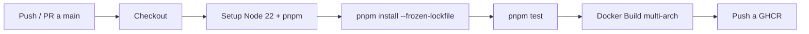

# Deployment & Infrastructure — Modu

> **Propósito**: Describir la infraestructura, el despliegue y la configuración de entornos.

---

## 1. Entornos

| Entorno | Propósito | URL |
|---------|-----------|-----|
| `development` | Desarrollo local | `http://localhost:3000` (API), `http://localhost:5173` (Frontend) |
| `production` | Producción | Definida en deploy |

## 2. Docker

### 2.1 Desarrollo (`docker-compose.dev.yml`)

```yaml
Servicios:
  postgres: → puerto 5432 (con extensión pgvector habilitada)
  redis:     → puerto 6379
  backend:   → puerto 4000 : 3000 (hot reload con volúmenes)
```

Inicio:
```bash
docker compose -f docker-compose.dev.yml up
```

### 2.2 Producción (`docker-compose.prod.yml`)

Usa el `Dockerfile` multi-stage:

```
Stage 1: Build
  - Instalar dependencias
  - Compilar TypeScript
  - Generar Prisma Client

Stage 2: Run (imagen final, alpine)
  - Solo copiar dist/ + node_modules/ + package.json
  - Ejecutar con node, no con nest start
```

Inicio:
```bash
docker compose -f docker-compose.prod.yml up --build -d
```

### 2.3 Dockerfile Multi-stage

| Stage | Base | Propósito |
|-------|------|-----------|
| `builder` | `node:22-alpine` | Instalar dependencias + build |
| `runner` | `node:22-alpine` | Ejecutar en producción |

## 3. CI/CD (GitHub Actions)

Workflow: `.github/workflows/CI.yml`



Pasos:
1. Checkout del repositorio
2. Setup Node.js 22 con pnpm 10
3. Instalación con `--frozen-lockfile` (garantiza lockfile actualizado)
4. Ejecución de tests del backend
5. Build de imagen Docker multi-arch (amd64 + arm64)
6. Push a GitHub Container Registry (`ghcr.io/<org>/<repo>`)

## 4. Variables de Entorno

### 4.1 Backend

| Variable | Requerida | Default | Propósito |
|----------|-----------|---------|-----------|
| `DATABASE_USER` | ✅ | — | Usuario de la base de datos |
| `DATABASE_PASSWORD` | ✅ | — | Password de la base de datos |
| `DATABASE_NAME` | ✅ | — | Nombre de la base de datos |
| `DATABASE_HOST` | ✅ | `localhost` | Host de la base de datos |
| `DATABASE_PORT` | ✅ | `5432` | Puerto de la base de datos (PostgreSQL) |
| `DATABASE_URL` | ✅ | — | Connection string PostgreSQL (Prisma) |
| `SECRET_PASSPORT` | ✅ | — | Secreto JWT |
| `AZURE_STORAGE_CONNECTION_STRING` | ✅ | — | Azure Blob |
| `AZURE_DI_ENDPOINT` | ✅ | — | Azure Document Intelligence |
| `AZURE_DI_KEY` | ✅ | — | Azure DI Key |
| `OPENAI_API_URL` | ❌ | — | URL API OpenAI |
| `OPENAI_API_KEY` | ❌ | — | Key API OpenAI |
| `PORT` | ❌ | `3000` | Puerto del backend |
| `REDIS_HOST` | ❌ | `redis` | Host Redis |
| `REDIS_PORT` | ❌ | `6379` | Puerto Redis |
| `REDIS_PASSWORD` | ❌ | — | Password Redis |

### 4.2 Frontend

| Variable | Requerida | Default | Propósito |
|----------|-----------|---------|-----------|
| `VITE_API_URL` | ✅ | `http://localhost:3000/api/v1` | URL base de la API |
| `VITE_APP_NAME` | ❌ | `Modu` | Nombre de la app |
| `VITE_MOCK_ENABLED` | ❌ | `true` | Usar mocks en desarrollo |
| `VITE_AUTH_METHOD` | ❌ | `db` | Método de autenticación (`db`/`ldap`) |

> ⚠️ **Problema detectado**: `VITE_API_URL` apunta a `/api/v1` pero el backend no tiene prefix `/api/v1`. Corregir en frontend o agregar global prefix en NestJS.

## 5. Base de Datos

### 5.1 Migraciones

```bash
pnpm db:generate  # Prisma generate
pnpm db:migrate   # Prisma migrate deploy
pnpm db:push      # Prisma db push (solo desarrollo)
pnpm db:seed      # Ejecutar seeders (roles RBAC, vector RAG, etc.)
```

> La migración vigente es `20260819144300_init` (crea el schema completo, incluyendo tablas RBAC `Role`/`Permission`/`Resource`/`RolePermission`/`SystemUserRole`). El seeder `roles.seeder.ts` (incluido en `db:seed`) siembra recursos, permisos y roles RBAC de forma idempotente.

### 5.2 Seeders

Archivo: `packages/modu-database/prisma/seeders/main.seeder.ts`

Los seeders deben ser idempotentes (ejecutables múltiples veces sin duplicar datos). Seeders activos: `roles.seeder.ts` (RBAC) y `vector.seeder.ts` (base vectorial RAG).

## 6. Comandos de Producción

```bash
# Iniciar API
pnpm start:prod   # node dist/apps/api/src/main.js

# Iniciar CLI (--employee-id es opcional)
pnpm start:cli user:create-admin -e admin@email.com -p Pass1234 \
  --first-name Admin --last-name Sistema
```

> **Documentos relacionados**: [Architecture](02-architecture.md), [Development Conventions](09-development-conventions.md)