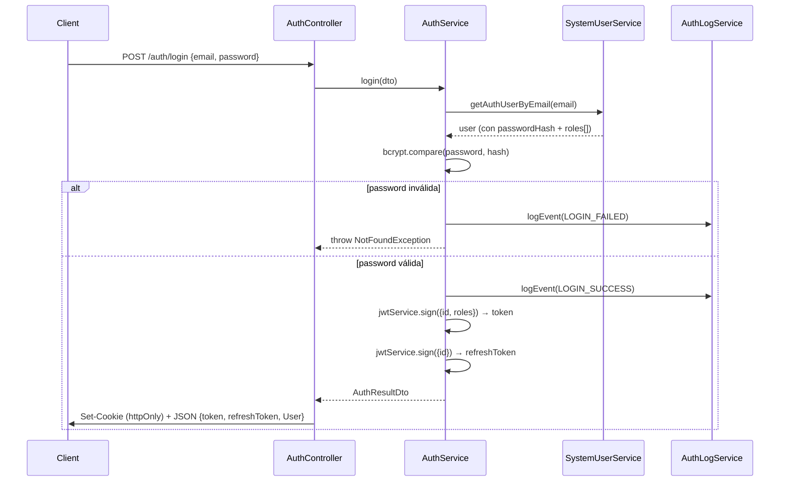

# Backend Modules — Modu

> **Propósito**: Describir cada módulo del backend, sus responsabilidades, estructura y dependencias.

---

## 1. Auth

| Propiedad | Valor |
|-----------|-------|
| **Ruta** | `modules/auth/` |
| **Propósito** | Autenticación JWT, registro, refresh, guards de autorización (RBAC) |
| **Token DI** | `'AuthService'` |

### Endpoints

| Método | Ruta | Auth | Roles | Descripción |
|--------|------|------|-------|-------------|
| POST | `/auth/login` | ❌ | — | Login con email + password. Retorna JWT + refresh token. Setea cookie httpOnly |
| POST | `/auth/refresh` | ❌ | — | Recibe `{ refreshToken }`, emite nuevos access (1h) + refresh (2d) tokens |
| POST | `/auth/register` | ✅ | ADMIN | Crear nuevo usuario (rol RBAC por nombre) |
| POST | `/auth/logout` | ✅ | * | Limpia cookie `access_token` |
| GET | `/auth/me` | ✅ | * | Retorna usuario autenticado actual |

### Flujo de Login



> El payload JWT es `{ id, roles: string[] }` — `roles` son los nombres de rol RBAC del usuario (no un rol único).

### Guards

| Guard | Propósito |
|-------|-----------|
| `JwtGuard` | Verifica JWT desde header `Authorization: Bearer` o cookie `access_token` |
| `RolesGuard` | Consulta roles y permisos del usuario en BD (`PrismaService`); **bypass total para `SUPERADMIN`**; valida `@Roles()` **o** `@Permissions()` (todos requeridos). 403 en caso contrario |

### RBAC (roles, recursos, permisos)

- **Constantes**: `modules/auth/constants/roles.constants.ts` (`ROLES` = `SUPERADMIN`, `ADMIN`, `BASIC`; `ROLE_DEFINITIONS` con permisos por rol) y `permissions.constants.ts` (`RESOURCES` + `PERMISSIONS` tipados como `ResourceName`/`PermissionName`).
- **Decoradores**: `@Roles(...)`, `@Permissions(...)`.
- **Seeder**: `prisma/seeders/roles.seeder.ts` inserta/actualiza recursos, permisos y roles (idempotente) con `pnpm run db:seed`.
- **Endpoints de lectura**: ver módulo `Rbac` (sección 12) — `GET /roles/all`, `GET /roles`, `GET /roles/:identifier`, `GET /permissions`.

### Dependencias

- `SystemUserService` — obtener usuario por email
- `JwtService` — firmar/verificar tokens
- `AuthLogService` — registrar eventos de autenticación

---

## 2. SystemUser

| Propiedad | Valor |
|-----------|-------|
| **Ruta** | `modules/system-user/` |
| **Propósito** | CRUD de usuarios del sistema |
| **Token DI** | `'SystemUserService'`, `'SystemUserRepository'` |

### Endpoints

| Método | Ruta | Auth | Roles | Descripción |
|--------|------|------|-------|-------------|
| GET | `/users` (también `/user`) | ⚠️ | — | Lista paginada con filtros (sin `@Roles`; `JwtGuard` del controlador comentado — ver Roadmap §3.2) |
| GET | `/users/:id` | ✅ | ADMIN, BASIC | Obtener por ID |
| GET | `/users/email/:email` | ✅ | ADMIN | Obtener por email |
| PUT | `/users/:id` | ✅ | ADMIN | Actualizar usuario (firstName, lastName, phoneNumber, role) |

> `@Controller(['user', 'users'])` — el controlador responde en ambas rutas.
>
> ⚠️ **Cambio (2026-08-20)**: el `@UseGuards(JwtGuard)` a nivel de controlador está **comentado**. La protección se aplica por ruta con `@UseGuards(RolesGuard)` + `@Roles(...)`; `GET /users` no tiene `@Roles`, por lo que solo depende de `RolesGuard` (agujero pendiente — ver [Roadmap](07-roadmap-todo.md) §3.2).

### Roles RBAC

- `SystemUser.role` (enum) fue reemplazado por la relación N:N `SystemUserRole` → `Role`. `SystemUserDto` expone `roles: string[]`.
- `create`/`createAdmin`/`update` resuelven el rol por `Role.name` desde BD; si el rol no existe o está inactivo → `BadRequestException('Invalid role: ...')`.
- El filtro `role` del listado mapea a `roles: { some: { role: { name } } }`.

### Normalizaciones

- **Email**: `trim().toLowerCase()`
- **employeeId**: `trim().toUpperCase().replace(/[^A-Z0-9]/g, '')` — **opcional** (si no viene, el usuario no se vincula a `Employee`)

### Dependencias

- `SystemUserRepository` — acceso a datos

---

## 3. AiAnalysis

| Propiedad | Valor |
|-----------|-------|
| **Ruta** | `modules/ai-analysis/` |
| **Propósito** | Orquestación de llamadas a IA con trazabilidad completa |
| **Token DI** | `'AiAnalysisOrchestratorService'`, `'AiAnalysisRepository'`, `'AiProviderService'` |

### Endpoints

| Método | Ruta | Auth | Roles | Descripción |
|--------|------|------|-------|-------------|
| GET | `/ai-analysis/:id` | ✅ | — | Obtener análisis por ID |
| GET | `/ai-analysis` | ✅ | ADMIN, BASIC | Lista paginada |
| POST | `/ai-analysis/analyze-text` | ✅ | — | Analizar texto con IA |

### Caché por Hash

El sistema genera un hash SHA-256 del texto de entrada. Si existe un análisis previo con el mismo hash, retorna el resultado cacheado sin llamar a OpenAI.

### Proveedores

| Proveedor | Implementación | Estado |
|-----------|----------------|--------|
| OpenAI | `OpenAIProviderService` | ✅ Implementado |

### Tipos de Análisis

| Tipo | Uso |
|------|-----|
| `VALIDATION_REQUEST_ITEM` | Análisis genérico de texto |
| `PENSUM_IMPORT` | Importación de pensum (sin implementar aún) |
| `STUDENT_SUBJECT_IMPORT` | Importación de materias (sin implementar aún) |

### Dependencias

- `AiAnalysisRepository` — persistencia de análisis
- `AiProviderService` — llamada al proveedor IA

---

## 4. Storage

| Propiedad | Valor |
|-----------|-------|
| **Ruta** | `modules/storage/` |
| **Propósito** | Abstracción de almacenamiento de archivos |
| **Token DI** | `'FileStorageService'` |

### Contenedores

| Nombre | Propósito |
|--------|-----------|
| `subject-documents` | Documentos de materias |
| `academic-transcripts` | Transcripciones académicas |

### Operaciones

| Método | Descripción |
|--------|-------------|
| `upload(file, options)` | Subir archivo. Retorna URL, nombre almacenado, metadata |
| `download(container, fileName)` | Descargar archivo como stream |
| `delete(container, fileName)` | Eliminar archivo |
| `exists(container, fileName)` | Verificar existencia |
| `getUrl(container, fileName)` | Obtener URL pública |

### Implementaciones

| Implementación | Estado |
|----------------|--------|
| `AzureBlobStorageService` | ✅ Implementado |

### Dependencias

- `ConfigService` — connection string de Azure

---

## 5. Document

| Propiedad | Valor |
|-----------|-------|
| **Ruta** | `modules/document/` |
| **Propósito** | Extracción de texto de documentos (OCR) |
| **Token DI** | `'DocumentTextExtractorService'` |

> ⚠️ **Carencia detectada**: Este módulo solo tiene el servicio. No tiene controlador ni rutas REST. No es accesible desde frontend.

### Interface

```typescript
interface DocumentTextExtractorService {
  extractText(file: Buffer, mimeType?: string): Promise<ExtractedDocument>;
}
```

### Implementaciones

| Implementación | Estado |
|----------------|--------|
| `AzureDocumentTextExtractorService` | ✅ Implementado |

### Dependencias

- `ConfigService` — endpoint y key de Azure Document Intelligence

---

## 6. Notification

| Propiedad | Valor |
|-----------|-------|
| **Ruta** | `modules/notification/` |
| **Propósito** | Notificaciones internas por usuario |
| **Token DI** | Inyección directa de clase |

### Endpoints

| Método | Ruta | Auth | Descripción |
|--------|------|------|-------------|
| GET | `/notifications` | ✅ | Lista paginada de notificaciones del usuario |
| GET | `/notifications/unread-count` | ✅ | Contador de no leídas |
| PATCH | `/notifications/read-all` | ✅ | Marcar todas como leídas |
| PATCH | `/notifications/:id/read` | ✅ | Marcar una como leída |

> ⚠️ **Inconsistencia**: Este controlador parsea `page` y `pageSize` manualmente desde query params en lugar de usar `PaginationQueryDto`.

### Servicios Internos

| Método | Descripción |
|--------|-------------|
| `notifyUser(data)` | Notificar a un usuario |
| `notifyUsers(list)` | Notificar a múltiples usuarios (batch insert) |
| `notifyByRoles(roles, data, buildLink, exclude?)` | Notificar a todos los usuarios activos que tengan **alguno** de los roles RBAC indicados (filtro `roles.some.role.name.in`) |

### Dependencias

- `PrismaService` — acceso a datos

---

## 7. AuthLog

| Propiedad | Valor |
|-----------|-------|
| **Ruta** | `modules/auth-log/` |
| **Propósito** | Registro de eventos de autenticación (login, logout, fallos) |

> `GET /auth-logs` requiere `@Roles(ROLES.ADMIN)`.

### Eventos

| Evento | Cuándo ocurre |
|--------|---------------|
| `LOGIN_SUCCESS` | Login exitoso |
| `LOGIN_FAILED` | Login fallido (email incorrecto o password inválido) |
| `LOGOUT` | Cierre de sesión |

### Regla de Negocio

El logging de autenticación **nunca debe interrumpir el flujo principal**. Se implementa con `safeLogEvent()` que captura cualquier error y solo hace `console.error`.

---

## 8. SystemLog

| Propiedad | Valor |
|-----------|-------|
| **Ruta** | `modules/SystemLog/` |
| **Propósito** | Auditoría de cambios en entidades del sistema |

> `findAll` requiere `@Roles(ROLES.ADMIN)`. `GET /system-logs/:id`, `POST`, `PATCH` y `DELETE` solo requieren JWT (aún sin guard de rol — ver Roadmap). El service selecciona `roles` (N:N) del usuario.

### Campos

| Campo | Descripción |
|-------|-------------|
| `actionType` | Tipo de acción (CREATE, UPDATE, DELETE) |
| `entityName` | Nombre de la entidad afectada |
| `entityId` | ID de la entidad |
| `oldValue` | Valor anterior (JSON) |
| `value` | Valor nuevo (JSON) |
| `userId` | Usuario que realizó la acción |

---

## 9. CLI

| Propiedad | Valor |
|-----------|-------|
| **Ruta** | `cli/` |
| **Framework** | Commander.js |

### Comandos

| Comando | Descripción |
|---------|-------------|
| `user:create-admin` | Crear usuario vía CLI con rol definido (ADMIN o BASIC, default BASIC) |

```bash
pnpm start:cli user:create-admin \
  -e admin@sistema.com \
  -p MiClave123 \
  --first-name Admin \
  --last-name Sistema \
  --employee-id 99999999   # opcional
  --role ADMIN             # opcional (ADMIN | BASIC, default: BASIC)
```

> `--employee-id` es **opcional** (misma regla que `CreateSystemUserDto`): si se omite, el admin se crea sin vínculo a `Employee`.
> `--role` (2026-08-20) define el rol RBAC del usuario (se normaliza a mayúsculas); si se omite, `CreateAdminCliDto.role` usa `ROLES.BASIC` por defecto. El comando pasó de "crear el primer administrador" a "crear un usuario administrador o básico".

---

## 10. Paquetes Compartidos

### @modu/shared

| Artefacto | Ubicación | Propósito |
|-----------|-----------|-----------|
| `PaginationQueryDto` | `src/dtos/` | DTO base con `page` y `pageSize` |
| `PagedResultDto<T>` | `src/dtos/` | Interfaz genérica de paginación |
| `PrismaExceptionFilter` | `src/filters/` | Captura errores Prisma y responde HTTP |
| `prisma-pagination.helper.ts` | `src/shared/helpers/` | **Helper genérico de paginación + filtros Prisma** (2026-08-20) — `paginatePrisma()`, `buildWhereFromFilters()` y `resolvePagination()`; cada repository pasa closures de su propio delegate y una `filterConfig` con specs (`string | number | boolean | enum`) o **transformers** (funciones) para filtros complejos (ej. `role` → `roles.some.role.name`). Usado por `PrismaSystemUserRepository` y `PrismaAiAnalysisRepository`. **Guía de uso**: [08-pagination-filtering.md](08-pagination-filtering.md) |

### @modu/database

| Artefacto | Ubicación | Propósito |
|-----------|-----------|-----------|
| `PrismaModule` | `src/prisma.module.ts` | Módulo NestJS |
| `PrismaService` | `src/prisma.service.ts` | Servicio singleton |
| `PrismaUnitOfWork` | `src/unit-of-work/` | Transacciones atómicas |
| `UnitOfWork` | `src/unit-of-work/` | Interfaz del patrón |

---

## 11. RAG / Búsqueda (datos externos)

Infraestructura de búsqueda sobre **PostgreSQL 14 + pgvector** (ADR-012). Los modelos Prisma (`Document`, `DocumentChunk`, `EmbeddingModel`, `IngestionRun`) existen en `prisma/schema.prisma`; los datos se restauran vía seeder y el acceso es con SQL crudo (`$queryRaw`). La búsqueda **no usa IA**: semántica directa por vector + full-text/trigram.

### 11.1 Seeder vectorial

| Propiedad | Valor |
|-----------|-------|
| **Ubicación** | `prisma/seeders/vector.seeder.ts` |
| **Dump** | `prisma/dump/rai_vector_pg14.sql` (sanitizado de PG17 → PG14) |
| **Comando** | `pnpm run db:seed:vector` (también corre con `pnpm run db:seed`) |
| **Idempotencia** | Omite si `document_chunks` tiene filas (`to_regclass` + `count(*)`) |

### 11.2 Tablas

| Tabla | Modelo Prisma | Rol | Embedding |
|-------|---------------|-----|-----------|
| `documents` | `Document` | Documentos fuente (metadatos + hash) | — |
| `document_chunks` | `DocumentChunk` | Fragmentos de texto con embedding | `vector(1024)`, índice HNSW cosine |
| `embedding_models` | `EmbeddingModel` | Modelo que generó los embeddings | — |
| `ingestion_runs` | `IngestionRun` | Runs de ingesta (estado, contadores) | — |

> Los modelos están en `prisma/schema.prisma` con `@map` a `snake_case`; `embedding` (`vector`) y `search_vector` (`tsvector`) son `Unsupported(...)`. Las tablas NO son gestionadas por migraciones Prisma — se crean/restauran con el seeder.

### 11.3 Módulo `rag` — búsqueda sin IA

| Propiedad | Valor |
|-----------|-------|
| **Ubicación** | `apps/api/src/modules/rag/` (JWT) |
| **Semántica (vector)** | `POST /rag/search` — recibe el `embedding` ya calculado; `ORDER BY dc.embedding <=> $vector::vector LIMIT N` vía `$queryRaw` |
| **Texto (full-text)** | `GET /rag/text-search?q=...` — `websearch_to_tsquery` sobre `search_vector`, ranking `ts_rank_cd` + trigram `similarity()` |
| **Documentos** | `GET /rag/documents?limit&offset` — listado paginado del índice con `chunkCount` (JOIN agregado sobre `document_chunks`), ordenado por `created_at DESC` |
| **Contexto** | `GET /rag/chunks/:id/context?before&after` — devuelve un chunk (datos completos + metadata del documento) con los chunks vecinos del mismo documento por `chunk_index` (contenido completo previo/posterior), para lectura de contexto alrededor de un resultado |

Servicio único: `PostgresRagService` (token `RagService`) con métodos `searchVector()`, `searchText()`, `listDocuments()` y `getChunkContext()` (interfaz `RagService`), más `buildFilters()` compartido por las dos búsquedas.
| **Filtros** | `department`, `project`, `sensitivity`; semántica además `minScore` (1 - distancia); ambos `limit` |

### 11.4 Pendiente / opcional

- Búsqueda híbrida: combinar resultados vectoriales con full-text (`search_vector`) y trigram (`similarity`).
- (Opcional) Vectorización de consultas con `nvidia/nv-embedqa-e5-v5` (`input_type=query`) para que `POST /rag/search` acepte texto libre.
- **Endpoint de subida/ingesta de documentos** — `StorageModule` hoy solo expone servicios internos (local/Azure), sin controller HTTP; el frontend (`UploadDocumentView`) espera ese endpoint.

---

## 12. Rbac

| Propiedad | Valor |
|-----------|-------|
| **Ruta** | `modules/rbac/` |
| **Propósito** | Consulta de roles, permisos y recursos RBAC (lectura) — base para la UI de administración |
| **Token DI** | `'RbacService'`, `'RbacRepository'` |

> Añadido 2026-08-20 (`6b0e858`). Registrado en `app.module.ts`. El controlador NO tiene `@UseGuards(JwtGuard)` a nivel de clase (comentado); la protección es por ruta con `@UseGuards(RolesGuard)` y `@Roles(ADMIN)` donde aplica.

### Endpoints

| Método | Ruta | Roles | Descripción |
|--------|------|-------|-------------|
| GET | `/roles/all` | — (solo `RolesGuard`) | Roles con sus permisos completos (`RoleDto[]`) |
| GET | `/roles` | — (solo `RolesGuard`) | Resumen de roles con `permissionCount` (`RoleSummaryDto[]`) |
| GET | `/roles/:identifier` | ADMIN | Rol por **id (numérico)** o **nombre** con permisos; 404 si no existe |
| GET | `/permissions` | ADMIN | Permisos agrupados por recurso (`PermissionDto[]`) |

### DTOs

| DTO | Ubicación | Contenido |
|-----|-----------|-----------|
| `RoleDto` | `dto/role.dto.ts` | `id, name, description, isActive, permissions: PermissionDto[], createdAt, updatedAt` |
| `RoleSummaryDto` | ídem | `id, name, description, isActive, permissionCount, createdAt, updatedAt` |
| `PermissionDto` | `dto/permission.dto.ts` | `id, name, description, resource, resourceId` |

Todos tienen un factory estático `fromEntity()` para mapear desde la entidad Prisma (`RoleWithPermissions`, `RoleSummaryEntity`, `PermissionWithResource`).

### Dependencias

- `PrismaRbacRepository` (`'RbacRepository'`) — consultas a `role`, `permission`, `resource`
- `DefaultRbacService` (`'RbacService'`) — orquesta y mapea a DTOs

---

> **Documentos relacionados**: [Architecture](../02-architecture.md), [Data Model](02-data-model.md), [Business Logic](03-business-logic.md), [Roadmap](07-roadmap-todo.md)