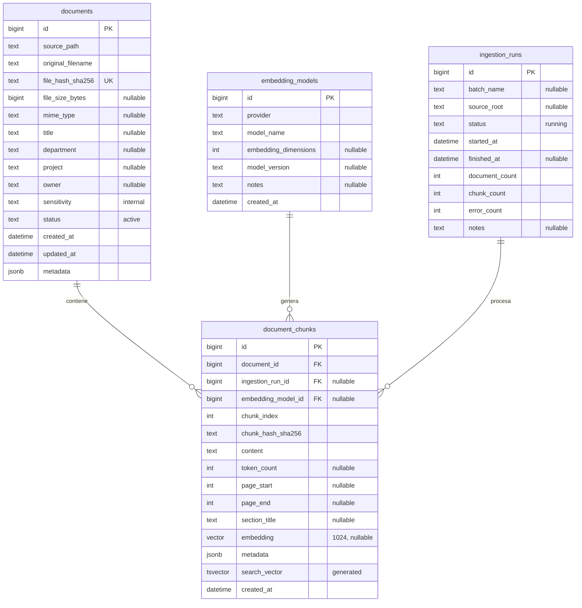

# Data Model — Modu (Backend)

> **Propósito**: Describir el modelo de datos relacional, sus entidades, relaciones y restricciones.

---

## 1. Diagrama Entidad-Relación

```mermaid
erDiagram
    SystemUser {
        int id PK
        string firstName
        string lastName
        string employeeId UK "nullable" "FK Employee.employeeId"
        string email UK
        string passwordHash
        string phoneNumber "nullable"
        bool isActive
        datetime createdAt
        datetime updatedAt
        datetime deletedAt "nullable"
    }

    Role {
        int id PK
        string name UK "SUPERADMIN|ADMIN|BASIC"
        string description "nullable"
        bool isActive
        datetime createdAt
        datetime updatedAt
        datetime deletedAt "nullable"
    }

    Resource {
        int id PK
        string name UK
        string description "nullable"
    }

    Permission {
        int id PK
        string name UK "system-user:read, ai-analysis:create, ..."
        string description "nullable"
        int resourceId FK
    }

    RolePermission {
        int roleId PK,FK
        int permissionId PK,FK
    }

    SystemUserRole {
        int userId PK,FK
        int roleId PK,FK
    }

    AuthLog {
        int id PK
        int userId FK "nullable"
        string email "nullable"
        enum event "LOGIN_SUCCESS|LOGIN_FAILED|LOGOUT"
        string ipAddress "nullable"
        string userAgent "nullable"
        datetime createdAt
    }

    SystemLog {
        int id PK
        int userId FK "nullable"
        string actionType
        string entityName
        int entityId "nullable"
        text oldValue "nullable"
        text value "nullable"
        string ipAddress "nullable"
        datetime createdAt
        datetime updatedAt
        datetime deletedAt "nullable"
    }

    AiAnalysis {
        int id PK
        enum analysisType "VALIDATION_REQUEST_ITEM|PENSUM_IMPORT|STUDENT_SUBJECT_IMPORT"
        int analyzedById FK "nullable"
        string provider "nullable"
        string model
        string modelVersion "nullable"
        string promptVersion "nullable"
        json prompt
        json response
        string inputHash "nullable"
        int promptTokens "nullable"
        int completionTokens "nullable"
        int totalTokens "nullable"
        decimal estimatedCost "nullable"
        int processingTimeMs "nullable"
        enum status "PENDING|RUNNING|COMPLETED|FAILED"
        string errorMessage "nullable"
        datetime startedAt "nullable"
        datetime completedAt "nullable"
        datetime createdAt
    }

    Notification {
        int id PK
        int userId FK
        enum type "GENERIC|INFO|WARNING|ERROR"
        string title
        text message
        string link "nullable"
        bool isRead
        datetime readAt "nullable"
        datetime createdAt
    }

    SystemUser ||--o{ AuthLog : "tiene"
    SystemUser ||--o{ SystemLog : "registra"
    SystemUser ||--o{ AiAnalysis : "solicita"
    SystemUser ||--o{ Notification : "recibe"
    SystemUser ||--o{ SystemUserRole : "tiene"
    Role ||--o{ SystemUserRole : "asignado a"
    Role ||--o{ RolePermission : "tiene"
    Permission ||--o{ RolePermission : "otorga"
    Resource ||--o{ Permission : "agrupa"
    Employee ||--o{ SystemUser : "se vincula"
```

> **Nota**: `SystemUser.employeeId` es FK a `Employee.employeeId` (relación opcional 1—N: un empleado puede vincularse a varios usuarios del sistema). El rol dejó de ser un enum (`UserRole`) y pasó a una tabla `Role` con permisos granulares (RBAC — ADR-013). Las tablas RBAC se crearon en la migración `20260819144300_init`; el resto del schema HR y sync se creó en `20260818141955_add_connections_and_external_sync`.

### 1.1 Tablas vectoriales (RAG) — modeladas en Prisma, no gestionadas por migraciones



> **Nota**: estas 4 tablas fueron restauradas desde un `pg_dump` externo (`prisma/dump/rai_vector_pg14.sql`) mediante el seeder `prisma/seeders/vector.seeder.ts`. **Sí están modeladas en `schema.prisma`** (modelos `Document`, `DocumentChunk`, `EmbeddingModel`, `IngestionRun`), pero **no son gestionadas por migraciones Prisma** — el schema se crea/restaura con el seeder. Las columnas `vector`/`tsvector` se modelan como `Unsupported("vector")` / `Unsupported("tsvector")`; las operaciones se acceden con SQL crudo (`$queryRaw`). La búsqueda no usa IA: semántica directa por vector (`<=>`), full-text (`search_vector`) + trigram, y listado de documentos con `chunkCount` — todo en el módulo `rag` (`PostgresRagService`). Los embeddings fueron generados con `nvidia/nv-embedqa-e5-v5` (1024 dimensiones, `input_type=passage`).

---

## 2. Entidades

### 2.1 SystemUser

Usuario del sistema. Base de cualquier operación.

| Campo | Tipo | Restricciones | Descripción |
|-------|------|---------------|-------------|
| `id` | Int | PK, autoincrement | ID único |
| `firstName` | VarChar(100) | NOT NULL | Nombre |
| `lastName` | VarChar(100) | NOT NULL | Apellido |
| `employeeId` | VarChar(50) | UNIQUE, NULLABLE, FK → Employee.employeeId | ID del empleado vinculado |
| `email` | VarChar(150) | UNIQUE, NOT NULL | Email institucional |
| `passwordHash` | VarChar(255) | NOT NULL | Hash bcrypt |
| `phoneNumber` | VarChar(25) | NULLABLE | Teléfono |
| `isActive` | Boolean | DEFAULT true | Usuario activo |
| `createdAt` | DateTime | DEFAULT now() | Fecha creación |
| `updatedAt` | DateTime | @updatedAt | Fecha actualización |
| `deletedAt` | DateTime | NULLABLE | Soft delete |

**Índices**: `email`, `employeeId`, `isActive`, `firstName + lastName`

**Relaciones**: `employeeId → Employee.employeeId` (opcional, `ON DELETE SET NULL`); roles N:N vía `SystemUserRole` → `Role` (RBAC — los roles ya no son un enum `UserRole`).

### 2.2 AuthLog

Registro de eventos de autenticación.

| Campo | Tipo | Restricciones | Descripción |
|-------|------|---------------|-------------|
| `id` | Int | PK, autoincrement | ID único |
| `userId` | Int | FK → SystemUser.id, NULLABLE | Usuario (si existe) |
| `email` | VarChar(150) | NULLABLE | Email intentado |
| `event` | Enum(AuthEvent) | NOT NULL | LOGIN_SUCCESS, LOGIN_FAILED, LOGOUT |
| `ipAddress` | VarChar(45) | NULLABLE | IP origen |
| `userAgent` | Text | NULLABLE | User-Agent |
| `createdAt` | DateTime | DEFAULT now() | Fecha del evento |

**Índices**: `userId`, `email`, `event`, `createdAt`

### 2.3 SystemLog

Auditoría de cambios en entidades.

| Campo | Tipo | Restricciones | Descripción |
|-------|------|---------------|-------------|
| `id` | Int | PK, autoincrement | ID único |
| `userId` | Int | FK → SystemUser.id, NULLABLE | Usuario que realizó el cambio |
| `actionType` | VarChar(100) | NOT NULL | CREATE, UPDATE, DELETE |
| `entityName` | VarChar(100) | NOT NULL | Nombre de la entidad |
| `entityId` | Int | NULLABLE | ID de la entidad afectada |
| `oldValue` | Text | NULLABLE | JSON del valor anterior |
| `value` | Text | NULLABLE | JSON del valor nuevo |
| `ipAddress` | VarChar(45) | NULLABLE | IP origen |
| `createdAt` | DateTime | DEFAULT now() | Fecha del cambio |
| `updatedAt` | DateTime | @updatedAt | Última modificación |
| `deletedAt` | DateTime | NULLABLE | Soft delete |

**Índices**: `userId`, `actionType`, `entityName`, `entityId`, `createdAt`

### 2.4 AiAnalysis

Trazabilidad de llamadas a IA.

| Campo | Tipo | Restricciones | Descripción |
|-------|------|---------------|-------------|
| `id` | Int | PK, autoincrement | ID único |
| `analysisType` | Enum(AiAnalysisType) | NOT NULL | Tipo de análisis |
| `analyzedById` | Int | FK → SystemUser.id, NULLABLE | Usuario que solicitó |
| `provider` | VarChar(30) | NULLABLE | Proveedor (ej: "OpenAI") |
| `model` | VarChar(50) | NOT NULL | Modelo usado (ej: "gpt-4") |
| `modelVersion` | VarChar(50) | NULLABLE | Versión del modelo |
| `promptVersion` | VarChar(20) | NULLABLE | Versión del prompt |
| `prompt` | Json | NOT NULL | Prompt enviado (system + user) |
| `response` | Json | NOT NULL | Respuesta parseada |
| `inputHash` | VarChar(64) | NULLABLE | SHA-256 del input (para caché) |
| `promptTokens` | Int | NULLABLE | Tokens del prompt |
| `completionTokens` | Int | NULLABLE | Tokens generados |
| `totalTokens` | Int | NULLABLE | Total de tokens |
| `estimatedCost` | Decimal(10,6) | NULLABLE | Costo estimado en USD |
| `processingTimeMs` | Int | NULLABLE | Tiempo de procesamiento |
| `status` | Enum(AiAnalysisStatus) | DEFAULT COMPLETED | Estado del análisis |
| `errorMessage` | Text | NULLABLE | Mensaje de error |
| `startedAt` | DateTime | NULLABLE | Inicio del procesamiento |
| `completedAt` | DateTime | NULLABLE | Fin del procesamiento |
| `createdAt` | DateTime | DEFAULT now() | Fecha de creación |

**Índices**: `analyzedById`, `status`, `createdAt`, `analysisType`, `inputHash`

### 2.5 Notification

Notificaciones internas del sistema.

| Campo | Tipo | Restricciones | Descripción |
|-------|------|---------------|-------------|
| `id` | Int | PK, autoincrement | ID único |
| `userId` | Int | FK → SystemUser.id | Usuario destinatario |
| `type` | Enum(NotificationType) | NOT NULL | GENERIC, INFO, WARNING, ERROR |
| `title` | VarChar(150) | NOT NULL | Título de la notificación |
| `message` | Text | NOT NULL | Cuerpo del mensaje |
| `link` | VarChar(255) | NULLABLE | Enlace relacionado |
| `isRead` | Boolean | DEFAULT false | Leída o no |
| `readAt` | DateTime | NULLABLE | Fecha de lectura |
| `createdAt` | DateTime | DEFAULT now() | Fecha de creación |

**Índices**: `userId + isRead`, `createdAt`

### 2.6 Tablas vectoriales (RAG)

Restauradas desde dump externo; **modeladas en Prisma** (`Document`, `DocumentChunk`, `EmbeddingModel`, `IngestionRun` en `schema.prisma`) pero **sin migraciones** — se crean con el seeder. Las columnas `vector`/`tsvector` son `Unsupported`; las consultas de similitud son SQL crudo (`$queryRaw`).

#### 2.6.1 documents

| Campo | Tipo | Restricciones | Descripción |
|-------|------|---------------|-------------|
| `id` | BigInt | PK | ID único |
| `source_path` | Text | NOT NULL | Ruta del documento en la fuente |
| `original_filename` | Text | NOT NULL | Nombre original del archivo |
| `file_hash_sha256` | Text | UNIQUE, NOT NULL | Hash del archivo |
| `file_size_bytes` | BigInt | NULLABLE | Tamaño en bytes |
| `mime_type` | Text | NULLABLE | Tipo MIME |
| `title` | Text | NULLABLE | Título |
| `department` | Text | NULLABLE | Departamento |
| `project` | Text | NULLABLE | Proyecto |
| `owner` | Text | NULLABLE | Propietario |
| `sensitivity` | Text | DEFAULT 'internal' | Nivel de sensibilidad |
| `status` | Text | DEFAULT 'active' | Estado |
| `created_at` | Timestamptz | DEFAULT now() | Fecha creación |
| `updated_at` | Timestamptz | DEFAULT now() | Fecha actualización |
| `metadata` | Jsonb | DEFAULT '{}' | Metadatos extendidos |

**Índices**: `file_hash_sha256`, `department + project`, `project + department + sensitivity + status`, `sensitivity`, trigram (`title`, `original_filename`)

#### 2.6.2 document_chunks

| Campo | Tipo | Restricciones | Descripción |
|-------|------|---------------|-------------|
| `id` | BigInt | PK | ID único |
| `document_id` | BigInt | FK → documents.id, NOT NULL, ON DELETE CASCADE | Documento origen |
| `ingestion_run_id` | BigInt | FK → ingestion_runs.id, NULLABLE, ON DELETE SET NULL | Run de ingesta |
| `embedding_model_id` | BigInt | FK → embedding_models.id, NULLABLE, ON DELETE SET NULL | Modelo de embedding |
| `chunk_index` | Int | NOT NULL | Índice dentro del documento |
| `chunk_hash_sha256` | Text | NOT NULL | Hash del chunk |
| `content` | Text | NOT NULL | Texto del fragmento |
| `token_count` | Int | NULLABLE | Nº de tokens |
| `page_start` | Int | NULLABLE | Página inicial |
| `page_end` | Int | NULLABLE | Página final |
| `section_title` | Text | NULLABLE | Título de sección |
| `embedding` | vector(1024) | NULLABLE | Embedding del chunk |
| `metadata` | Jsonb | DEFAULT '{}' | Metadatos (department, document_type, etc.) |
| `search_vector` | tsvector | GENERATED (to_tsvector('simple', content)) | Full-text |
| `created_at` | Timestamptz | DEFAULT now() | Fecha creación |

**Índices**: `document_id`, `chunk_hash_sha256 + embedding_model_id` (UNIQUE), `document_id + chunk_index` (UNIQUE), **HNSW** `embedding vector_cosine_ops` WHERE embedding IS NOT NULL, GIN (`metadata`), GIN (`search_vector`)

#### 2.6.3 embedding_models

| Campo | Tipo | Restricciones | Descripción |
|-------|------|---------------|-------------|
| `id` | BigInt | PK | ID único |
| `provider` | Text | NOT NULL | Proveedor (ej: nvidia) |
| `model_name` | Text | NOT NULL | Modelo (ej: nvidia/nv-embedqa-e5-v5) |
| `embedding_dimensions` | Int | NULLABLE | Dimensiones del vector |
| `model_version` | Text | NULLABLE | Versión |
| `notes` | Text | NULLABLE | Notas (input_type, truncate, etc.) |
| `created_at` | Timestamptz | DEFAULT now() | Fecha creación |

**Índices**: `provider + model_name + model_version` (UNIQUE)

#### 2.6.4 ingestion_runs

| Campo | Tipo | Restricciones | Descripción |
|-------|------|---------------|-------------|
| `id` | BigInt | PK | ID único |
| `batch_name` | Text | NULLABLE | Nombre del lote |
| `source_root` | Text | NULLABLE | Raíz de origen |
| `status` | Text | DEFAULT 'running' | Estado (running/completed/failed) |
| `started_at` | Timestamptz | DEFAULT now() | Inicio |
| `finished_at` | Timestamptz | NULLABLE | Fin |
| `document_count` | Int | DEFAULT 0 | Documentos procesados |
| `chunk_count` | Int | DEFAULT 0 | Chunks generados |
| `error_count` | Int | DEFAULT 0 | Errores |
| `notes` | Text | NULLABLE | Notas |

**Índices**: `id` (PK)

---

### 2.7 Employee (dominio HR)

Empleado del dominio HR/organizacional (Odoo-like). `employeeId` es el ID legado/externo (p. ej. de Odoo) y es la referencia usada por `SystemUser.employeeId`.

| Campo | Tipo | Restricciones | Descripción |
|-------|------|---------------|-------------|
| `id` | BigInt | PK, autoincrement | ID único |
| `employeeId` | VarChar(50) | UNIQUE, NOT NULL | ID legado/externo (Odoo) |
| `name` | VarChar(200) | NOT NULL | Nombre |
| `email` | VarChar(255) | UNIQUE, NULLABLE | Email |
| `jobId` | BigInt | FK → Job.id, NULLABLE | Puesto |
| `departmentId` | BigInt | FK → Department.id, NULLABLE | Departamento |
| `organizationId` | BigInt | FK → Organization.id, NULLABLE | Organización |
| `lobId` | BigInt | FK → Lob.id, NULLABLE | Línea de negocio |
| `locationId` | BigInt | FK → WorkLocation.id, NULLABLE | Ubicación |
| `modalityId` | BigInt | FK → Modality.id, NULLABLE | Modalidad |
| `hiredDate` | Date | NULLABLE | Fecha de contratación |
| `endDate` | Date | NULLABLE | Fecha de fin |
| `status` | Enum(EmployeeStatus) | DEFAULT PENDING | ACTIVE, LICENSE, INACTIVE, TERMINATED, PENDING |
| `createdAt` | DateTime | DEFAULT now() | Fecha creación |
| `updatedAt` | DateTime | @updatedAt | Última modificación |
| `deletedAt` | DateTime | NULLABLE | Soft delete |

**Índices**: `employeeId` (UNIQUE), `status`, `departmentId`, `organizationId`, `lobId`, `locationId`

> **Nota**: `SystemUser.employeeId` → FK a `Employee.employeeId` (`ON DELETE SET NULL`). El schema HR/empleados (Organization, Department, Job, Lob, Modality, WorkLocation, Employee, EmployeeDetail, Assignment, EmploymentHistory, IdentityChangeLog, exits, staging, sync) y RBAC se materializa en la migración actual `20260819144300_init` (ver §4 — el schema es multi-file en `prisma/models/`).

### 2.8 Connection (conexiones a APIs / bases de datos externas)

Representa una conexión configurada hacia una **API externa** (Odoo, Genesys, Kimai…) o una **base de datos externa**, para los procesos de ingestión/sincronización. Los secretos (`credentialsEncrypted`) se almacenan **cifrados en la capa de aplicación** (AES-256-GCM, formato `IV 12B || authTag 16B || ciphertext`) con versión de clave en `encryptionKeyVersion` para permitir rotación.

| Campo | Tipo | Restricciones | Descripción |
|-------|------|---------------|-------------|
| `id` | BigInt | PK, autoincrement | ID único |
| `name` | VarChar(150) | UNIQUE, NOT NULL | Nombre de la conexión |
| `type` | Enum(ConnectionType) | NOT NULL | `API` o `DATABASE` |
| `status` | Enum(ConnectionStatus) | DEFAULT ACTIVE | ACTIVE, INACTIVE, ERROR |
| `apiBaseUrl` | VarChar(500) | NULLABLE | URL base (solo tipo API) |
| `apiAuthType` | Enum(ApiAuthType) | NULLABLE | NONE, BEARER, BASIC, API_KEY, OAUTH2 |
| `databaseType` | Enum(DatabaseType) | NULLABLE | PostgreSQL, MySQL, MariaDB, SQL Server, Oracle, Other |
| `host` | VarChar(255) | NULLABLE | Host (solo tipo DATABASE) |
| `port` | Int | NULLABLE | Puerto (solo tipo DATABASE) |
| `databaseName` | VarChar(150) | NULLABLE | Base de datos (solo tipo DATABASE) |
| `username` | VarChar(150) | NULLABLE | Usuario (solo tipo DATABASE) |
| `credentialsEncrypted` | Text | NULLABLE | Secretos cifrados en app-layer (token/API key/password) |
| `encryptionKeyVersion` | VarChar(50) | NULLABLE | Versión de la clave de cifrado |
| `extraConfig` | Json | NULLABLE | Configuración adicional (headers, scopes, esquema…) |
| `lastTestedAt` | DateTime | NULLABLE | Última prueba de conexión |
| `lastConnectedAt` | DateTime | NULLABLE | Última conexión exitosa |
| `createdById` | BigInt | FK → SystemUser.id, NULLABLE (`ON DELETE SET NULL`) | Usuario que creó la conexión |
| `createdAt` / `updatedAt` | DateTime | now() / @updatedAt | Timestamps |
| `deletedAt` | DateTime | NULLABLE | Soft delete |

**Índices**: `name` (UNIQUE), `type`+`status`, `createdById`.

> **Cifrado**: el schema solo persiste el ciphertext (Texto) y la versión de clave; las claves maestras viven fuera de la base (env vars / KMS). No se almacenan secretos en texto plano ni en `extraConfig`.

### 2.9 RBAC — Roles, Recursos y Permisos

Dominio de autorización granular (ADR-013) en `prisma/models/platform/rbac.prisma`. Reemplaza el enum `UserRole` de `SystemUser`; los roles se siembran desde `prisma/seeders/roles.seeder.ts` (fuente de verdad: `apps/api/src/modules/auth/constants/`).

#### Role

| Campo | Tipo | Restricciones | Descripción |
|-------|------|---------------|-------------|
| `id` | Int | PK, autoincrement | ID único |
| `name` | VarChar(50) | UNIQUE, NOT NULL | `SUPERADMIN`, `ADMIN`, `BASIC` |
| `description` | VarChar(255) | NULLABLE | Descripción del rol |
| `isActive` | Boolean | DEFAULT true | Rol activo (los inactivos no otorgan permisos) |
| `createdAt` / `updatedAt` / `deletedAt` | DateTime | now() / @updatedAt / NULLABLE | Timestamps + soft delete |

**Índices**: `name` (UNIQUE), `isActive`.

#### Resource

| Campo | Tipo | Restricciones | Descripción |
|-------|------|---------------|-------------|
| `id` | Int | PK, autoincrement | ID único |
| `name` | VarChar(100) | UNIQUE, NOT NULL | Recurso (ej. `system-user`, `ai-analysis`, `rag`) |
| `description` | VarChar(255) | NULLABLE | Descripción |

#### Permission

| Campo | Tipo | Restricciones | Descripción |
|-------|------|---------------|-------------|
| `id` | Int | PK, autoincrement | ID único |
| `name` | VarChar(150) | UNIQUE, NOT NULL | `system-user:read`, `ai-analysis:create`, `rag:search`, … |
| `description` | VarChar(255) | NULLABLE | Descripción |
| `resourceId` | Int | FK → Resource.id, NOT NULL | Recurso al que pertenece |

**Índices**: `name` (UNIQUE), `resourceId`.

#### RolePermission (N:N Role ↔ Permission)

| Campo | Tipo | Restricciones |
|-------|------|---------------|
| `roleId` | Int | PK compuesta, FK → Role.id, `ON DELETE CASCADE` |
| `permissionId` | Int | PK compuesta, FK → Permission.id, `ON DELETE CASCADE` |

#### SystemUserRole (N:N SystemUser ↔ Role)

| Campo | Tipo | Restricciones |
|-------|------|---------------|
| `userId` | Int | PK compuesta, FK → SystemUser.id, `ON DELETE CASCADE` |
| `roleId` | Int | PK compuesta, FK → Role.id, `ON DELETE CASCADE` |

> **Semilla (seeder)**: `roles.seeder.ts` hace `upsert` de cada `Resource`, `Permission` y `Role` definidos en `permissions.constants.ts` / `roles.constants.ts`, y enlaza `RolePermission`. Roles sembrados: `SUPERADMIN` (sin permisos — bypass total en `RolesGuard`), `ADMIN` (todos los permisos), `BASIC` (solo RAG de lectura: `rag:read`, `rag:search`, `module:records`).

---

## 3. Enumeraciones

| Enum | Valores |
|------|---------|
| `AuthEvent` | `LOGIN_SUCCESS`, `LOGIN_FAILED`, `LOGOUT` |
| `NotificationType` | `GENERIC`, `INFO`, `WARNING`, `ERROR` |
| `AiAnalysisType` | `VALIDATION_REQUEST_ITEM`, `PENSUM_IMPORT`, `STUDENT_SUBJECT_IMPORT` |
| `AiRecommendation` | `APPROVE`, `REJECT`, `REVIEW_MANUAL` |
| `AiAnalysisStatus` | `PENDING`, `RUNNING`, `COMPLETED`, `FAILED` |
| `RecordStatus` | `ACTIVE`, `INACTIVE` |
| `EmployeeStatus` | `ACTIVE`, `LICENSE`, `INACTIVE`, `TERMINATED`, `PENDING` |
| `ReconciliationStatus` | `PENDING`, `MATCHED`, `UNMATCHED`, `ORPHAN`, `DUPLICATE` |
| `AssignmentType` | `COACH`, `MANAGER`, `OTHER` |
| `ExitReasonCategory` | `CONTROLLABLE`, `NON_CONTROLLABLE` |
| `ExitType` | `RESIGNATION`, `TERMINATION`, `REDUCTION`, `RETIREMENT`, `OTHER` |
| `SeparationOwnership` | `VOICE_TEAM`, `CLIENT`, `HR`, `OTHER` |
| `InterviewStatus` | `SCHEDULED`, `COMPLETED`, `NO_SHOW`, `ABANDONED`, `WAIVED` |
| `ActionItemStatus` | `OPEN`, `IN_PROGRESS`, `DONE`, `CANCELLED` |
| `QualityCheckStatus` | `OPEN`, `RESOLVED` |
| `ConnectionType` | `API`, `DATABASE` |
| `ConnectionStatus` | `ACTIVE`, `INACTIVE`, `ERROR` |
| `ApiAuthType` | `NONE`, `BEARER`, `BASIC`, `API_KEY`, `OAUTH2` |
| `DatabaseType` | `POSTGRESQL`, `MYSQL`, `MARIADB`, `SQLSERVER`, `ORACLE`, `OTHER` |
| `SyncSource` | `ODOO`, `GENESYS`, `KIMAI`, `INTRANET`, `OTHER` |
| `SyncType` | `PULL`, `PUSH`, `FULL`, `INCREMENTAL` |
| `SyncTrigger` | `MANUAL`, `CRON`, `N8N`, `API` |
| `SyncStatus` | `IN_PROGRESS`, `SUCCESS`, `FAILED`, `PARTIAL` |
| `StagingEmployeeStatus` | `NEW`, `PROCESSED`, `ERROR`, `DUPLICATE`, `ORPHAN` |
| `StagingExitStatus` | `NEW`, `PROCESSED`, `ERROR`, `DUPLICATE` |
| `StagingGenesysStatus` | `NEW`, `PROCESSED`, `ERROR`, `ORPHAN` |

> **Nota**: `AiRecommendation` está definido en el schema pero no se usa en el código actual.
>
> **Nota RBAC**: `UserRole` fue eliminado del schema — los roles viven en la tabla `Role` (`SUPERADMIN`, `ADMIN`, `BASIC`) con permisos granulares (`Permission`/`Resource`/`RolePermission`), relacionados a `SystemUser` vía `SystemUserRole` (N:N). Ver entidad 2.9 y ADR-013.
>
> **Nota RAG**: las tablas vectoriales (`documents`, `document_chunks`, `embedding_models`, `ingestion_runs`) están modeladas en `schema.prisma` (`Document`, `DocumentChunk`, `EmbeddingModel`, `IngestionRun`) pero **no son gestionadas por migraciones Prisma** — se crean/restauran con el seeder `prisma/seeders/vector.seeder.ts` desde `prisma/dump/rai_vector_pg14.sql`. No siguen las convenciones de timestamps/soft-delete de Prisma (usan `snake_case` y `created_at`/`updated_at` propios).

---

## 4. Convenciones del Schema Prisma

El schema es **multi-file** (Prisma folder schema) en `prisma/models/`:

- `_base.prisma` — `generator` y `datasource`.
- `enums.prisma` — todos los enums, agrupados por dominio.
- `<dominio>/*.prisma` — modelos agrupados por dominio:
  - `platform/` — SystemUser, AuthLog, SystemLog, AiAnalysis, Notification, **RBAC (Role, Resource, Permission, RolePermission, SystemUserRole)**.
  - `connections/` — Connection.
  - `hr/` — catálogos (Organization, Department, Job, Lob, Modality, WorkLocation, Platform), Employee, EmployeeDetail/Assignment, EmploymentHistory/IdentityChangeLog, exits (ExitReason, EmployeeExit, ExitInterview, ExitActionItem, DataQualityCheck).
  - `sync/` — SyncJob/PlatformSyncLog y staging (StagingEmployee, StagingExit, StagingGenesysUser).
  - `rag/` — Document, DocumentChunk, EmbeddingModel, IngestionRun.

Reglas:
- **IDs**: autoincrementales (`BigInt` en tablas de datos; `Int` en la plataforma)
- **Timestamps**: `createdAt`, `updatedAt` en todas las tablas
- **Soft delete**: `deletedAt: DateTime?` para borrado lógico
- **Índices**: Foreign keys siempre indexadas, campos de búsqueda indexados
- **Strings**: `VarChar` con tamaño explícito (excepto `Text` para contenido largo)
- **Enums**: siempre en `enums.prisma`, agrupados por dominio, nunca embebidos en los modelos
- **Nuevos modelos**: se añaden en el archivo del dominio correspondiente; si es un dominio nuevo, se crea subcarpeta en `prisma/models/`

## 5. Transacciones

El patrón Unit of Work permite ejecutar operaciones multi-tabla en una transacción:

```typescript
// Configuración
maxWait: 10s   // Tiempo máximo para obtener conexión
timeout: 60s   // Duración máxima de la transacción

// Uso
await unitOfWork.executeTransaction(async (tx) => {
  const user = await userRepo.create(data, tx);
  await logRepo.create({ userId: user.id, action: 'CREATE' }, tx);
});
```

> **Documentos relacionados**: [Backend Modules](01-modules.md), [Business Logic](03-business-logic.md)