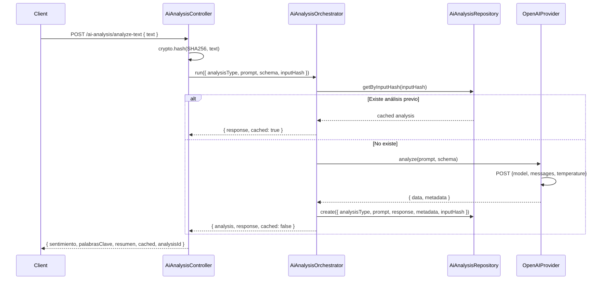

# Business Logic — Modu (Backend)

> **Propósito**: Describir la lógica de negocio y los flujos críticos del backend.

---

## 1. Flujo de Autenticación

### 1.1 Login

```
1. Validar DTO (email formato, password >= 8 chars)
2. Buscar usuario por email en SystemUserRepository
   └── Si no existe → AuthLog(LOGIN_FAILED) → 404
3. Comparar password con bcrypt.compare()
   └── Si no coincide → AuthLog(LOGIN_FAILED) → 404 (mismo error que "no existe" por seguridad)
4. AuthLog(LOGIN_SUCCESS)
5. Generar JWT: { id, role } con expiración 1h
6. Generar refresh token: { id } con expiración 7d
7. Setear cookie httpOnly: access_token
8. Retornar { token, refreshToken, Expiration, User }
```

### 1.2 Registro (solo ADMIN)

```
1. Validar DTO (firstName >= 3, lastName >= 3, password >= 8, email válido)
2. Validar rol por nombre RBAC (debe existir en la tabla Role y estar activo)
3. Hash password con bcrypt (costo 10)
4. Normalizar email (lowercase, trim)
5. Crear SystemUser via SystemUserService.create() (conecta rol por Role.name)
6. Retornar SystemUserDto (sin passwordHash, con roles[])
```

### 1.3 Logout

```
1. Limpiar cookie access_token
2. AuthLog(LOGOUT) → fire-and-forget (no debe fallar el logout si el log falla)
```

---

## 2. CRUD de Usuarios

### 2.1 Crear (desde servicio/CLI)

```
1. Resolver rol por nombre RBAC en la tabla Role (si no existe/inactivo → 400)
2. Normalizar employeeId si viene (uppercase, sin espacios, solo A-Z0-9) — opcional
3. Normalizar email (lowercase, trim)
4. Hash password con bcrypt (si viene de CLI)
5. Crear en base de datos (relación N:N SystemUserRole + Employee opcional)
6. Retornar SystemUserDto (roles[])
```

### 2.2 Actualizar (solo ADMIN)

```
1. Buscar usuario por ID → si no existe, 404
2. Actualizar solo campos permitidos (firstName, lastName, phoneNumber, role)
   NOTA: email y passwordHash no se actualizan por este endpoint
3. Si role cambia, validar el nombre RBAC contra la tabla Role (isActive)
4. Reemplazar la asignación de rol (deleteMany + create SystemUserRole)
5. Retornar SystemUserDto actualizado (roles[])
```

### 2.3 Listar con filtros (helper `paginatePrisma`)

```
1. Paginación obligatoria (page, pageSize) — normalizada con resolvePagination() (page >= 1, pageSize default 10)
2. Filtros opcionales declarados en filterConfig del repository:
   - specs simples: string → { contains }, number → Number, boolean → "true"/true, enum → valor directo
   - transformer (función): filtros complejos que devuelven un fragmento de where (ej. role → roles: { some: { role: { name } } })
   - los valores vacíos (undefined/null/'') se ignoran
3. El helper ejecuta count + findMany en paralelo (Promise.all) y compone el PagedResultDto
4. Retornar PagedResultDto<SystemUserDto> (items con roles[])
```

> **2026-08-20** (`260e904`): la lógica de paginación/filtros se movió a `src/shared/helpers/prisma-pagination.helper.ts`. `PrismaSystemUserRepository.getUsers()` y `PrismaAiAnalysisRepository.findAll()` pasan closures tipadas de su delegate Prisma (`count`/`findMany`) + `filterConfig`, y el helper construye el `where`, calcula `skip`/`take` y devuelve `{ items, totalItems, page, pageSize, totalPages }`.

---

## 3. Análisis con IA

### 3.1 Flujo analyze-text



### 3.2 Esquema de Análisis de Texto (actual)

```typescript
z.object({
  sentimiento: z.enum(['positivo', 'negativo', 'neutral']),
  palabrasClave: z.array(z.string()),
  resumen: z.string(),
})
```

### 3.3 Prompt Actual (analyze-text)

```
System: Eres un analizador de texto. Analiza el texto del usuario y devuelve SOLO un JSON...

User: {dto.text}

Model: gpt-5-mini  ← ⚠️ Este modelo no existe en OpenAI. Corregir a gpt-4o-mini o gpt-4o
Temperature: 0.3
```

---

## 4. Notificaciones

### 4.1 Notificar por Roles

```
1. Buscar usuarios activos (isActive=true, deletedAt=null) con los roles indicados
2. Excluir opcionalmente un userId (para no notificar al que ejecuta la acción)
3. Crear notificaciones en batch (createMany)
4. Cada notificación puede tener un link diferente según el rol del destinatario
```

### 4.2 Paginación de Notificaciones

```
1. Parámetros: page (default 1), pageSize (default 10, max 50)
2. Filtro opcional: onlyUnread
3. Orden: createdAt DESC
4. Retornar { items, totalItems, unreadCount, page, pageSize, totalPages }
```

---

## 5. Almacenamiento de Archivos

### 5.1 Subida

```
1. Recibir Buffer + opciones (container, fileName, folder, contentType, size)
2. Crear nombre único: `${Date.now()}-${fileName}`
3. Si folder especificado: `${folder}/${uniqueName}`
4. Crear container si no existe (createIfNotExists)
5. Subir con uploadData (Buffer → BlockBlobClient)
6. Retornar { fileName, storedFileName, url, contentType, size, uploadedAt }
```

### 5.2 Descarga

```
1. Verificar que el blob existe
   └── Si no existe → 404
2. Descargar stream
3. Retornar { stream, fileName, contentType, size }
```

---

## 6. Soft Delete

| Acción | Comportamiento |
|--------|----------------|
| `findAll` | Filtrar `deletedAt: null` |
| `findOne` | Retorna el registro exista o no (no filtra) |
| `remove` | Setear `deletedAt: new Date()` |
| `create` | `deletedAt: null` por defecto |
| `update` | No modificar `deletedAt` |

---

## 7. Manejo de Errores

### 7.1 Jerarquía de Excepciones (AiAnalysis)

```
AiProviderException (base)
├── AiProviderConfigException  → Configuración faltante (OPENAI_API_URL no seteada)
├── AiProviderParseException   → Respuesta JSON inválida del AI
└── AiProviderException        → Error de red, HTTP error, etc.
```

### 7.2 Reglas de Error

- Los errores de configuración de proveedores externos deben lanzar excepciones específicas
- Los errores de red/HTTP deben incluir el status code y el cuerpo del error
- Los errores de parseo deben incluir el raw content para debugging
- El `PrismaExceptionFilter` transforma errores Prisma en HTTP responses con el formato adecuado

---

## 8. CLI

### 8.1 Comando: user:create-admin

```
1. Validar argumentos (email, password, --first-name, --last-name, --employee-id, --role opcionales)
2. Verificar que no exista usuario con ese email
   └── Si existe → ConflictException
3. Hash password con bcrypt (costo 10)
4. Resolver rol por nombre en la tabla Role (--role, default BASIC desde CreateAdminCliDto.role)
   └── Si el rol no existe/inactivo → BadRequestException
5. Normalizar employeeId (si viene) y email
6. Crear usuario con el rol indicado (vínculo a Employee solo si hay employeeId)
7. Retornar SystemUserDto (roles[])
```

> **2026-08-20** (`bd884b2`): el comando pasó de crear "el primer administrador" a crear **un usuario admin o básico**. Nueva opción `--role <ADMIN|BASIC>` (default `ROLES.BASIC`), normalizada a mayúsculas por `CreateAdminCliDto.role`. Descripciones y mensajes del CLI cambian de "Administrator/admin" a "User".

> **Documentos relacionados**: [Backend Modules](01-modules.md), [Data Model](02-data-model.md), [API & Integrations](04-api-integrations.md), [Pagination & Filters](08-pagination-filtering.md)