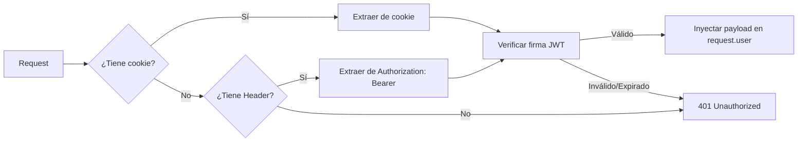
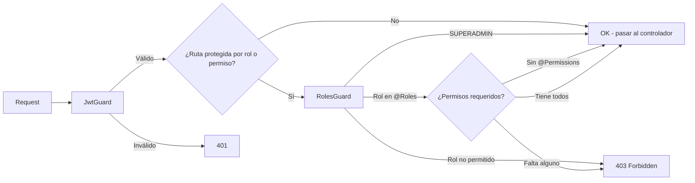
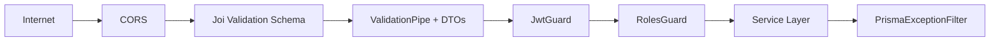

# Security — Modu (Backend)

> **Propósito**: Documentar el modelo de seguridad del backend: autenticación, autorización, auditoría y buenas prácticas.

---

## 1. Autenticación

### 1.1 Estrategia

| Componente | Implementación |
|------------|----------------|
| **Estrategia Passport** | `JwtStrategy` (passport-jwt) |
| **Extractores** | `ExtractJwt.fromAuthHeaderAsBearerToken()` + cookie extractor |
| **Secreto** | `SECRET_PASSPORT` (variable de entorno) |
| **Algoritmo** | HS256 (default de `@nestjs/jwt`) |
| **Expiración token** | 1 hora |
| **Expiración refresh token** | 7 días |

### 1.2 JWT Payload

```typescript
{
  id: number,      // SystemUser.id
  roles: string[]  // Nombres de rol RBAC (SUPERADMIN | ADMIN | BASIC)
}
```

### 1.3 Flujo de Validación



### 1.4 Hash de Contraseñas

| Propiedad | Valor |
|-----------|-------|
| **Algoritmo** | bcrypt |
| **Salt rounds** | 10 |
| **Librería** | `bcrypt` |

---

## 2. Autorización (RBAC)

### 2.1 Roles

| Rol | Nivel | Descripción |
|-----|-------|-------------|
| `SUPERADMIN` | 3 | Acceso total **sin validación** — `RolesGuard` hace bypass (omite chequeo de roles y permisos) |
| `ADMIN` | 2 | Acceso total. CRUD usuarios, configuración, logs (todos los permisos) |
| `BASIC` | 1 | Acceso de solo lectura. RAG: búsqueda (`rag:search`) y listado de documentos (`rag:read`), módulo `records` |

> Los roles viven en la tabla `Role` (RBAC en BD — ADR-013) y se siembran con `prisma/seeders/roles.seeder.ts`. El rol `STAFF` fue renombrado a `ANALYST` y luego a **`BASIC`** (2026-08-19); `STUDENT` fue eliminado.

### 2.2 Guards



`RolesGuard` consulta en BD (PrismaService) los roles y permisos del usuario autenticado:
- `@Roles(...)` → el usuario debe tener **al menos uno** de los roles (activos).
- `@Permissions(...)` → el usuario debe tener **todos** los permisos (vía los roles activos).
- **`SUPERADMIN`** → siempre autorizado (bypass).

### 2.3 Matriz de Permisos

| Endpoint | ADMIN | BASIC | SUPERADMIN |
|----------|-------|-------|------------|
| POST /auth/login | ✅ | ✅ | ✅ |
| POST /auth/refresh | ✅ | ✅ | ✅ |
| POST /auth/register | ✅ | ❌ | ✅ |
| POST /auth/logout | ✅ | ✅ | ✅ |
| GET /auth/me | ✅ | ✅ | ✅ |
| GET /users | ✅ | ✅ | ✅ (solo JWT) |
| GET /users/:id | ✅ | ✅ | ✅ |
| GET /users/email/:email | ✅ | ❌ | ✅ |
| PUT /users/:id | ✅ | ❌ | ✅ |
| GET /ai-analysis/:id | ✅ | ✅ | ✅ |
| GET /ai-analysis | ✅ | ✅ | ✅ |
| POST /ai-analysis/analyze-text | ✅ | ✅ | ✅ |
| GET /notifications | ✅ | ✅ | ✅ |
| PATCH /notifications/read-all | ✅ | ✅ | ✅ |
| PATCH /notifications/:id/read | ✅ | ✅ | ✅ |
| GET /system-logs | ✅ | ❌ | ✅ |
| GET /auth-logs | ✅ | ❌ | ✅ |
| GET /rag/text-search | ✅ | ✅ | ✅ |
| GET /rag/documents | ✅ | ✅ | ✅ |
| GET /rag/chunks/:id/context | ✅ | ✅ | ✅ |
| POST /rag/search | ✅ | ✅ | ✅ |
| GET /roles/all | ✅ | ✅ | ✅ (solo RolesGuard) |
| GET /roles | ✅ | ✅ | ✅ (solo RolesGuard) |
| GET /roles/:identifier | ✅ | ❌ | ✅ |
| GET /permissions | ✅ | ❌ | ✅ |

---

## 3. Auditoría

### 3.1 Tipos de Log

| Log | Propósito | Fire-and-forget |
|-----|-----------|-----------------|
| `AuthLog` | Eventos de autenticación (login, logout, fallos) | ✅ Sí |
| `SystemLog` | Cambios en entidades (CREATE, UPDATE, DELETE) | ❌ No (es parte del flujo) |

### 3.2 Regla Fundamental

> **El registro de auditoría nunca debe interrumpir el flujo principal.**

Esto aplica especialmente a `AuthLog` donde se usa `safeLogEvent()`:

```typescript
private async safeLogEvent(data: {...}): Promise<void> {
  try {
    await this.authLogService.logEvent(data);
  } catch (error) {
    console.error('No se pudo registrar el evento:', error);
    // El flujo continúa normalmente
  }
}
```

---

## 4. Cookies vs Headers

| Método | Propósito | Configuración |
|--------|-----------|---------------|
| Cookie `access_token` | Principal (SPA) | `HttpOnly; Secure; SameSite=Lax; Max-Age=3600` |
| Header `Authorization: Bearer` | Fallback | Para clientes que no soportan cookies |

**Problema detectado**: El frontend guarda el token en `localStorage` además de la cookie. Esto:
1. Rompe la seguridad `HttpOnly` de la cookie
2. Expone el token a XSS
3. Debe corregirse (ver [Frontend Security](../frontend/04-security.md))

---

## 5. Protecciones por Capa



| Capa | Protección |
|------|------------|
| **CORS** | Orígenes permitidos configurados en NestJS |
| **Joi Schema** | Validación de variables de entorno al iniciar la app |
| **ValidationPipe** | Validación de DTOs en cada endpoint (class-validator) |
| **JwtGuard** | Verificación de token JWT |
| **RolesGuard** | Verificación de rol en endpoints protegidos |
| **PrismaExceptionFilter** | Captura errores de BD y responde HTTP adecuadamente |

## 6. Configuración de Cookies

```typescript
response.cookie('access_token', token, {
  httpOnly: true,    // No accesible desde JavaScript
  secure: true,      // Solo HTTPS (en producción)
  sameSite: 'lax',   // Protección CSRF básica
  maxAge: 3600 * 1000, // 1 hora en milisegundos
});
```

> **Documentos relacionados**: [Business Logic](03-business-logic.md), [API & Integrations](04-api-integrations.md), [Frontend Security](../frontend/04-security.md)