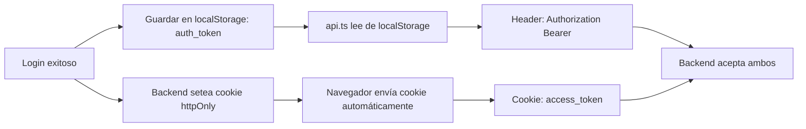

# Security — Modu (Frontend)

> **Propósito**: Documentar el modelo de seguridad en el frontend: manejo de tokens, contexto de autenticación, guards de navegación y buenas prácticas.

---

## 1. Manejo de Tokens

### 1.1 Estado Actual



**⚠️ Problema de seguridad**: El token se almacena en `localStorage` y también se recibe como cookie `httpOnly`. Esto:

1. **Anula la protección httpOnly**: La cookie httpOnly protege contra XSS porque JS no puede leerla. Pero al guardar el mismo token en `localStorage`, cualquier script XSS puede robarlo.
2. **Dos fuentes de verdad**: El frontend usa `localStorage` para enviar en Header, mientras que el navegador envía la cookie automáticamente.
3. **Refrescar token**: No hay mecanismo de refresh automático.

### 1.2 Solución Propuesta

| Acción | Prioridad | Descripción |
|--------|-----------|-------------|
| Eliminar `localStorage` del flujo | Alta | El frontend debe confiar solo en la cookie httpOnly. La cookie se envía automáticamente en cada request |
| Eliminar `Authorization` header del cliente | Alta | No es necesario si la cookie está configurada |
| Mantener `localStorage` solo para mock | Media | En modo mock no hay cookie, el token simulado debe almacenarse |
| Ajustar `api.ts` para modo producción | Alta | En producción, no enviar `Authorization` header, dejar que la cookie viaje sola |

### 1.3 Flujo Propuesto (Producción)

```
Login → Backend setea cookie httpOnly
Cada request → Navegador envía cookie automáticamente
Backend extrae JWT de la cookie via cookieExtractor
Logout → Backend limpia cookie
```

---

## 2. AuthContext

### 2.1 Estado

```typescript
interface AuthContextType {
  user: User | null
  token: string | null         // Solo usado en modo mock
  isAuthenticated: boolean
  isLoading: boolean
  error: string | null
  login: (credentials) => Promise<void>
  logout: () => Promise<void>
  clearError: () => void
}
```

`User` expone también `permissions: string[]` (permisos efectivos del usuario, resueltos por el backend en `/auth/me` y `/auth/login`; `SUPERADMIN` recibe todos). Para chequear un permiso usar `hasPermission(user, 'module:records')` de `services/auth.ts`.

### 2.2 Flujo de Inicialización

```
1. Al montar App:
   ├── Leer auth_token de localStorage (modo mock) o confiar en cookie
   ├── Si hay token → validateToken()
   │   ├── Éxito → setUser()
   │   └── Fallo → clearToken()
   └── isLoading = false
```

### 2.3 Flujo de Login

```
1. preValidateCredentials() (validación frontend)
2. apiLogin(credentials)
3. Guardar token en localStorage (solo si MOCK_ENABLED)
4. setUser() + setToken()
```

### 2.4 Flujo de Logout

```
1. apiLogout() → llama a POST /auth/logout
2. Limpiar localStorage
3. setUser(null) + setToken(null) + setError(null)
```

---

## 3. Guards de Navegación y RBAC en UI

### 3.1 ProtectedRoute / GuestRoute / IndexRedirect

Definidos en `routes/guards.tsx`:

| Guard | Condición | Acción |
|-------|-----------|--------|
| `ProtectedRoute` | `isAuthenticated === false && isLoading === false` | `Navigate to "/login"` |
| `GuestRoute` | `isAuthenticated === true && isLoading === false` | `Navigate to "/app/home"` |
| `IndexRedirect` | `isAuthenticated` | Autenticado → `/app/home`; invitado → `/login` |

Visual: `LoadingScreen` (spinner) mientras `isLoading`.

### 3.2 RecordsRoute (autorización por URL en `/app/records/:base?/:view?`)

Definido en `routes/records-route.tsx`. Valida **dos niveles** de permisos sobre la URL:

1. El módulo base (`:base`) debe estar autorizado con `module:<slug>` → si no, redirige al **primer módulo visible** (`getVisibleRecordModules`); si no hay ninguno → `/app/reports`.
2. La vista (`:view`) puede exigir un permiso extra declarado en `RecordViewOption.permission` (ej. `rag:upload-view` para la subida de RAG) → si falta, redirige al módulo sin la vista.

**Excepción Security**: `baseSlug === 'roles' | 'permissions'` se intercepta **antes** del lookup de `RECORD_MODULES` y renderiza `RbacRolesView` / `RbacPermissionsView` (datos de `GET /roles/all` y `GET /permissions`; esta última requiere rol ADMIN en el backend — el frontend no re-valida, confía en la respuesta 403).

### 3.3 Filtrado de menú por permisos (visibilidad)

Los permisos no solo protegen rutas: **ocultan items del sidebar y del panel de menú** (no-secretos; la autorización real sigue en el backend — ver T6 del Engram):

- Módulos de records → `module:<slug>` (`getVisibleRecordModules`).
- Opciones de vista → `RecordViewOption.permission` (ej. `rag:upload-view`).
- Quick links / secciones estáticas → `StaticSidebarItem.permission` (`isMenuItemVisible`; **sin `permission` el item siempre se muestra**). Roles/Permissions viven aquí como items estáticos navegables.
- La configuración de menú vive en `routes/menu.config.tsx` (`QUICK_LINKS`, `STATIC_SECTIONS`).

---

## 4. Manejo de Errores de Autenticación

| Escenario | Comportamiento Actual | Comportamiento Esperado |
|-----------|----------------------|------------------------|
| Token expirado | `validateToken` falla → limpia localStorage | Redirigir a login |
| 401 en llamada API | `ApiResponse.ok === false` → error sin manejo automático | Interceptor global que redirija a login |
| Error de red | `ApiResponse.status === 0` → error | Mostrar mensaje "Network error" |

**⚠️ Pendiente**: No hay un interceptor HTTP global que capture 401 y redirija automáticamente al login. Cada llamada debe manejar el error manualmente.

---

## 5. Exposición de Datos Sensibles

| Dato | ¿Expuesto en frontend? | Riesgo |
|------|------------------------|--------|
| Token JWT | Sí (localStorage) | Robo via XSS |
| User info | Sí (AuthContext) | Bajo (es datos públicos del perfil) |
| Password | No (solo en memoria durante login) | Ninguno |
| Password hash | No (nunca llega al frontend) | Ninguno |

---

## 6. Recomendaciones de Seguridad

| # | Recomendación | Prioridad |
|---|---------------|-----------|
| 1 | Eliminar almacenamiento de token en `localStorage` en producción | 🔴 Alta |
| 2 | Agregar interceptor HTTP 401 → redirect a login | 🔴 Alta |
| 3 | Implementar refresh token automático | 🟡 Media |
| 4 | Agregar rate limiting en login (backlog) | 🟡 Media |
| 5 | Validar origen de llamadas API (CORS) | 🟢 Ya implementado |
| 6 | No exponer roles en URL (ej: `/admin/...`) | 🟢 Ya implementado (usamos guards) |
| 7 | **Los permisos del menú son visibilidad de UI, no autorización** — ocultar una vista sin el permiso no basta: el backend debe rechazar con `@Permissions()` (T6 del Engram). Hoy `rag:upload` ya protege el envío; revisar cada endpoint expuesto | 🟡 Media |

> **Documentos relacionados**: [Backend Security](../backend/05-security.md), [API Client](03-api-client.md), [Frontend Modules](01-modules-pages.md)